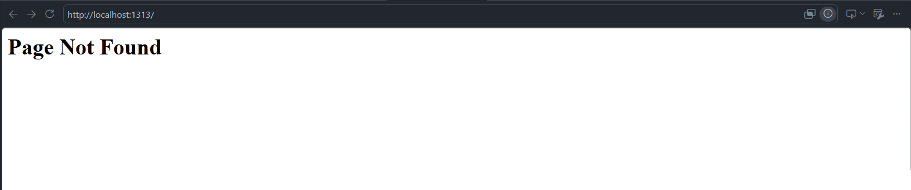
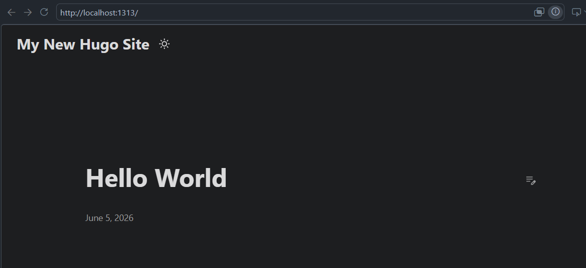
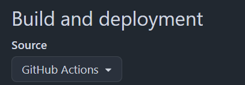
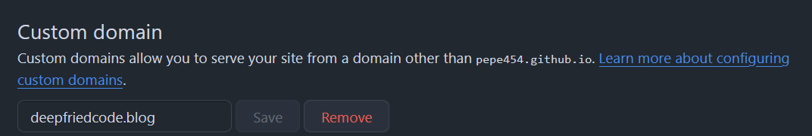
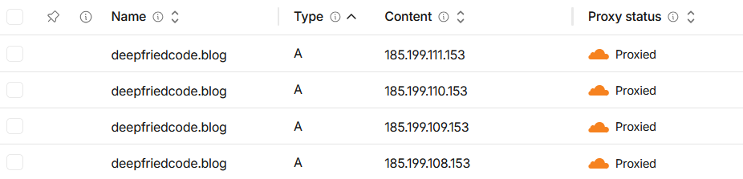
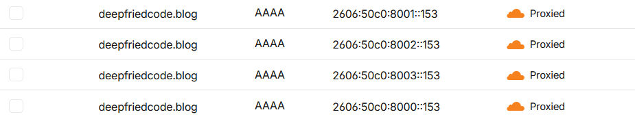
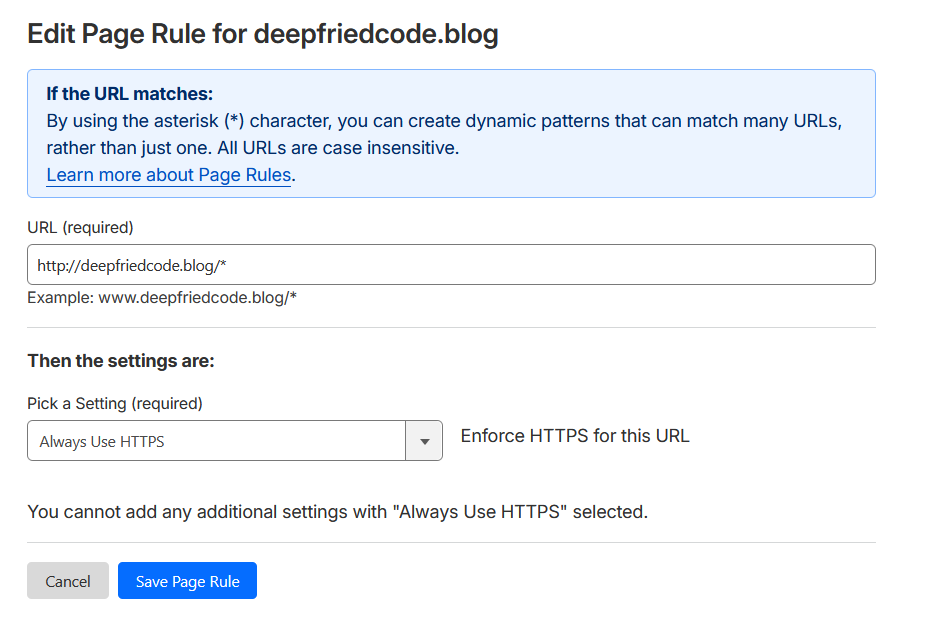
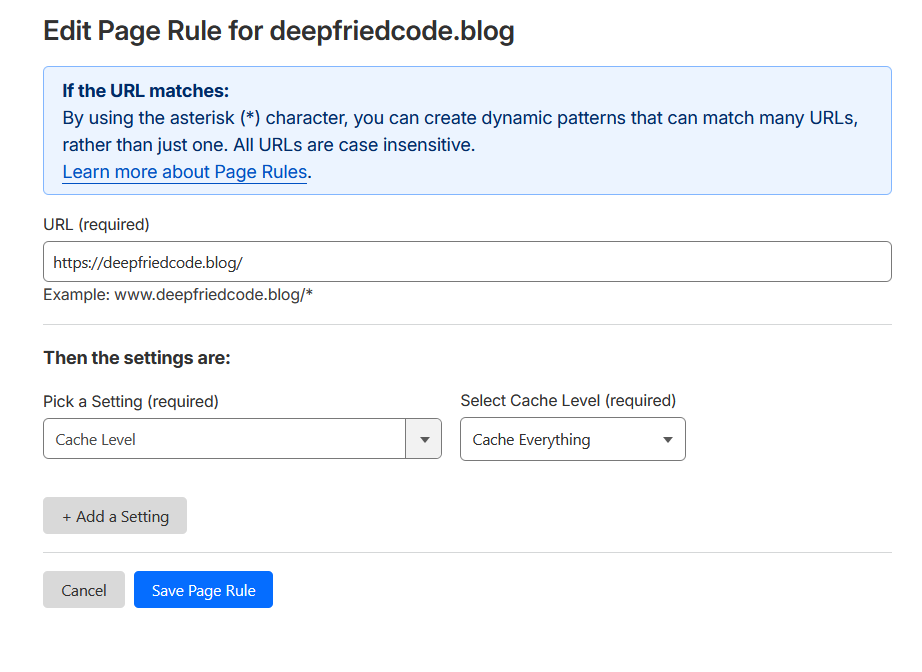
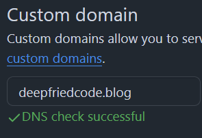

+++
date = '2026-06-05T14:51:13-04:00'
title = 'Building the Site'
+++


## Step 1: Setting Up Hugo 

Why hugo? I decided to choose a static site generator that was fast, easy to use, and had a lot of support. 
Now it was time to setup the environment. I am using WSL2 with Ubuntu, so the instructions will follow for that.


#### Installing hugo and setting up the site 

First, get hugo for ubuntu.
```bash
$ sudo apt install hugo
```

Next, I setup the project directory and generated the skeleton using hugo:
```bash
$ hugo new site deepfriedcode.blog
```

This put all the skeleton in place. However, my site had no content or theming! If we run the server now, we will get a Page not found:
```bash
$ cd deepfriedcode.blog
$ hugo server
```



Now let's add our first post and see if it works:

```bash
$ hugo new posts/first-post.md
```
This creates a new markdown file in the content/posts directory. However, we still end up getting a blank page when we use hugo server. This is because we have not added a theme yet.


#### Adding the theme

Let's add a theme to give a layout and structure to the website. I'm using the PaperMod theme, so let's add it now. First, add the theme as a submodule, which will clone the repository for the theme into your themes subfolder:
```bash
$ git submodule add --depth=1 https://github.com/adityatelange/hugo-PaperMod.git themes/PaperMod 
```

Now we need to configure the site. I edited the hugo.toml file like so: 
```python
baseURL = 'https://deepfriedcode.blog/'
languageCode = 'en-us'
title = 'Deep Fried Code'
theme = 'PaperMod'
```

Run the server again. This time, add the `-D` flag, which includes draft posts. These are posts that don't get built into your site in production.
```bash
$ hugo server -D
```

It's alive!



## Step 2: Deploying to github 

Follow the instructions at this post: [Host on GitHub Pages](https://gohugo.io/host-and-deploy/host-on-github-pages/)
You will need to setup the actions workflow to build the site and deploy it to github pages.


Once you have added the github workflow, it should build automatically when you commit push to github. great. Now, it's time to configure your repo.

In your repo > settings > Pages (under Code and Automation), select "Github Actions" as your source for the build and deployment:

If you have a custom domain like I do, you will need to put in your custom domain name like so:



*The custom domain will fail on the initial setup*. Don't worry! This is all part of it. Now we have to register our domain and have the DNS records point to the github site. 


## Step 3: Registering the domain

Now that we've got our github pages setup and the website is built, it's time to register a custom domain. I chose cloudflare, because I am familiar with it and have used it before. You can purchase a domain name here: [Cloudflare Registrar](https://www.cloudflare.com/products/registrar/)

Once you've gone and puchased the domain for your site, it's time to configure DNS. I followed this guide from Github on how to point DNS records for your custom domain to the github hosted site: [Managing a custom domain for your GitHub Pages site](https://docs.github.com/en/pages/configuring-a-custom-domain-for-your-github-pages-site/managing-a-custom-domain-for-your-github-pages-site). However, you can follow my instructions below and it should turn out just fine. 


This part took a little bit of trial and error for me, but if you follow my example it should be very straightforward. In order to configure DNS Records in cloudflare, on the left drawer in the cloudflare portal, go to DNS > Records. 

Now configure the A-name records. This will point the custom domain for your site to the github ipv4 addresses. Since there are multiple ipv4 addresses listed, you will need to create an A-name record for each one. In addition, assuming you're using the root of your custom domain, use the `@` symbol to reference that instead of a string. This is what your dashboard should look like after adding the A-name records:


Next, you can add the ipv6 addresses using AAAA-name records:



Finally, we can have the www.<custom-domain> also point as an alias to your custom domain. This will let www url's alias to your domain: 


After configuring the DNS Records, we want clients to use HTTPS instead of HTTP. This is a simple blog site, so HTTPS doesn't really matter, but browsers will users a warning for sites that use HTTP. On the left drawer, go to Rules > Page Rules. You can add a rule that will force clients to use HTTPS: 



We can also leverage Cloudflare's CDN to cache our site for better performance, by serving content in data centers closer to users:



## Step 4: Add content and redeploy

Ok! We've set up the website. We wrote our first markdown blog post. We pushed it to github. We configured github pages. We bought a domain name. We configured dns to point to github pages. Phew. That was a lot! I'm tired just typing that all out! 


Once we have a github pages site, we should actually add some content. Open that first-post.md file up, and add some content. It's time to deploy. You also need to set draft=False on the front matter. This will actually build the page when you run hugo build. Finally, we can build to generate the HTML from .md files:
```bash
$ hugo build
```

That should add a bunch of files in the `./public` directory in your project root. Go ahead and commit and push to github. Our site should start building automatically now. While that's happening, you can check on the custom domain settings. For me, this didn't work at first, because I had to configure cloudflare. After doing so, you should be able to retry adding your custom domain. If all goes well, you will get the fabled green checkmark and your site will be live on your custom domain:


Navigate to your custom domain on the browser, et voilà! Your site is live!


## Recap

I hope this guide was helpful for you and you were able to setup your website successfully. Using hugo, a prebuilt theme like PaperMod, hosting on Github pages, and using Cloudflare DNS are all surefire ways to make this process as easy as possible. 